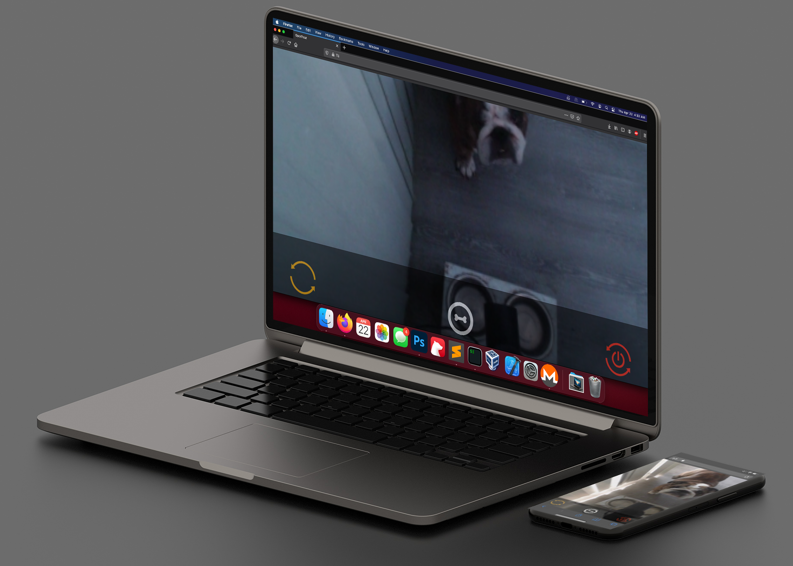

<h1 align="center">
  
</h1>

<div align="center">
	<a href="https://github.com/psycoder17/OpenTreat/graphs/commit-activity"></a>
	<a href="https://snyk.io/test/github/psycoder17/OpenTreat?targetFile=js/package.json"></a>
	<a href="https://github.com/psycoder17/OpenTreat/pulls"></a>
</div>

OpenTreat allows a user to view and interact with their pets while not at home. Watch a live video stream of your pets from your smartphone or laptop, and remotely dispense treats with the push of a button.

:movie_camera: [Watch video demo of OpenTreat](https://youtu.be/6tzPRBlFip4) :movie_camera:

## Treat dispenser system
### Overview
The treat dispenser system is built using a Raspberry Pi and 3D printed parts. When a user presses the button on the webapp, a Python script is executed on the Pi to turn the servo motor for a certain number of seconds. The servo motor turns the 3D printed auger and pushes the treat down the tube where it drops out the end and into the feeding bowl.

### Parts needed
* Raspberry Pi
* LS3006 servo (any 360* servo should work)
* 3D printer
* USB webcam

### Physical assembly
1. Download and 3D print each STL listed in the `models` folder
	1. The recommended print settings are in the Resources section below
2. Assemble the parts using super glue
3. Use the pinout diagram in the Resources section (or find one for your RPi model) to hook up the 3 servo wires to the Raspberry Pi’s GPIO pins

### Configure ngrok
OpenTreat utilizes [ngrok](https://ngrok.com/docs) to securely expose the PHP pages to the internet. An annual Basic plan subscription allows you to create stable, custom subdomains for your dispensers. This is needed before running the script to populate the templates.

```
cd ~/
wget https://bin.equinox.io/c/4VmDzA7iaHb/ngrok-stable-linux-arm.tgz
tar xf ngrok-stable-linux-arm.tgz
/home/pi/ngrok authtoken 1hTfjOEDlX771y5WHDHL4bCZ1gc_81262WDRezREwGHuxX8pJ
```

### Register for free TURN server account
Create a free account on http://numb.viagenie.ca. You will need the server & login details you receive via email to run `populate_templates.sh`.

### Clone the repo into a folder called OpenTreat in your Pi's home directory
```
git clone https://github.com/psycoder17/OpenTreat.git ~/OpenTreat/src
cd ~/OpenTreat/src/
```

### Generate personalized files from code templates
```
bash populate_templates.sh
```

### Test the servo script on your Raspberry Pi
A Python3 script takes advantage of the Raspberry Pi’s GPIO pins to send a signal to the servo motor when a user presses the treat button on the webapp. The script turns the servo for a set number of seconds to push the treat through the tube and drop it down at the end.

### Install Python dependencies
```
pip3 install -r python/requirements.txt
```

### Manually execute the script to test that the servo/auger spins
```
python3 python/rotate_auger.py
```

Now that your Raspberry Pi properly dispenses treats when the Python script runs, Apache needs to be setup to host a PHP file that executes the Python script when the browser is redirected to `<Raspberry Pi IP>:80/spin.php`.

### Configure Apache server
```
sudo bash rpi-www/setup.sh
```

Then add `www-data ALL=(root) NOPASSWD: /sbin/reboot ` to your `/etc/sudoers` file to allow the www-data user to reboot the Pi.

At this point the servo connected to the RPi should now spin when visiting `<Raspberry Pi IP>/spin.php` in a web browser.

### Configure Apache secrets
Due to account restrictions and permission errors with the `www-data` user, we need to run the `broadcast_webcam.py` script as user `pi`. Instead of hardcoding the Pi's password into the project's source code, we can set an environment variable that reads from the file `/var/www/secrets/pipw`.

```
sudo mkdir /var/www/secrets/
sudo chown pi:root /var/www/secrets/
echo "PI_PW=<pi-user-account-password>" > /var/www/secrets/pipw
echo "NGROK_PW=<ngrok-basic-auth-password>" >> /var/www/secrets/pipw
```

> Remember to replace `<pi-user-account-password>` with the password you set for `pi` when initially configuring your Raspberry Pi. `<ngrok-basic-auth-password>` should be set here **and** as a Config Var on the Settings page of your Heroku application.

## Video stream app
The video streaming app is built with Javascript using NodeJS, Express, WebRTC, and Socket.IO. The webapp is hosted in Heroku and allows a user to login and view the video stream being broadcasted from the Pi's webcam.

### Deploy the video streaming app to Heroku
```
cd js/

heroku create <my-opentreat-project>

git add .
git commit -m "commit message"
git push heroku master
```

If everything was successful you can now browse to `https://<my-opentreat-project>.herokuapp.com/broadcast` on your Raspberry Pi to manually start broadcasting the Pi's webcam to your webapp on Heroku.

## Usage
### Automatic startup
Create a cronjob with `crontab -e` to run a Python script on boot to automatically broadcast the Pi's webcam to the webapp hosted on Heroku. The shell script configures and launches the ngrok tunnel.

```
@reboot python3 /var/www/html/broadcast_webcam.py
@reboot /bin/bash /var/www/html/ot_ngrok.sh
```

### View the video stream
On your smartphone or laptop, browse to `https://<my-opentreat-project>.herokuapp.com` to view the video stream of your pets. 
Press the bone button to spin the auger and drop treats into your pets' bowl. 
The orange button restarts the webcam broadcast.
The red button reboots the Raspberry Pi.

## Resources
### Links
[Viagenie.ca: free TURN servers](http://numb.viagenie.ca)

[Thingiverse: original fish feeder model](https://www.thingiverse.com/thing:301532)

[GitHub: original WebRTC broadcasting webapp](https://github.com/TannerGabriel/WebRTC-Video-Broadcast)

### Recommended print settings
> Scale: 100%  
> Infill: 30%  
> Layer Height: 0.2  
> Speed: Standard  
> Supports: None

### RPi GPIO diagram
> Red wire - Pin 1 - 3v3 power  
> Black wire - Pin 6 - ground  
> Orange wire - Pin 11 - GPIO 17  


### Screenshots & proof-of-concept





